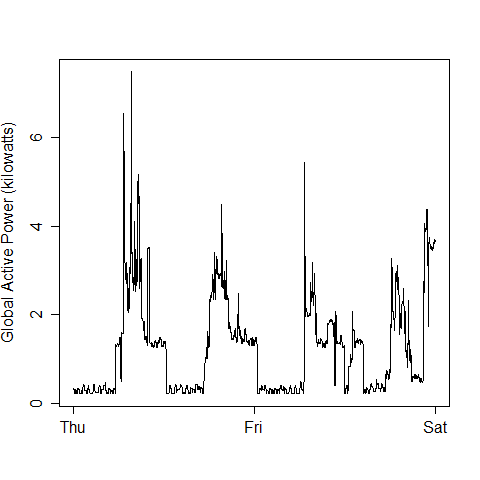

## Exploratory data analysis - Course project #1

Please note that the original forked repository with the guidelines for the project can be accessed here:

https://github.com/luperman/ExData_Plotting1

I created this repository to post the files required by the course project #1, there are 8 files in this repo:

4 files containing the R code to generate the plots 1 to 4.

4 files containing the png files generated with the 4 files described above.

The four plots that I have constructed are shown below.

### Plot 1

 

### Plot 2

 

### Plot 3

 

### Plot 4

