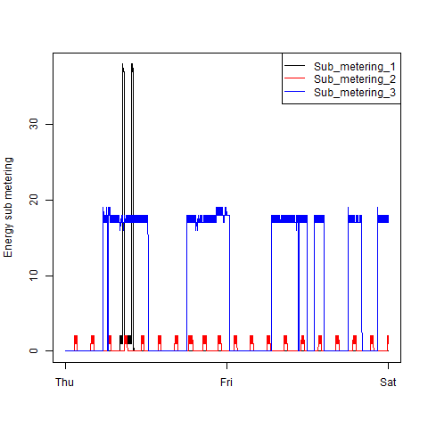

## Exploratory data analysis - Course project #1

### Please note that the original forked repository with the guidelines for the project can be accessed here:

### https://github.com/luperman/ExData_Plotting1

I created this separate repository since I wanted to have my own readme.md so you could read my explanations as soon as you landed here.

There are 9 files in this repo:

.gitattributes: this file was created automatically by the GitHub application for windows, so I left it here. 

4 R-files containing the R-code to generate the plots 1 to 4.

4 png files containing the plots 1 to 4, they were generated using the 4 R-files described above.

The four plots that I have constructed are shown below.

### Plot 1

 

### Plot 2

 

### Plot 3

 

### Plot 4

